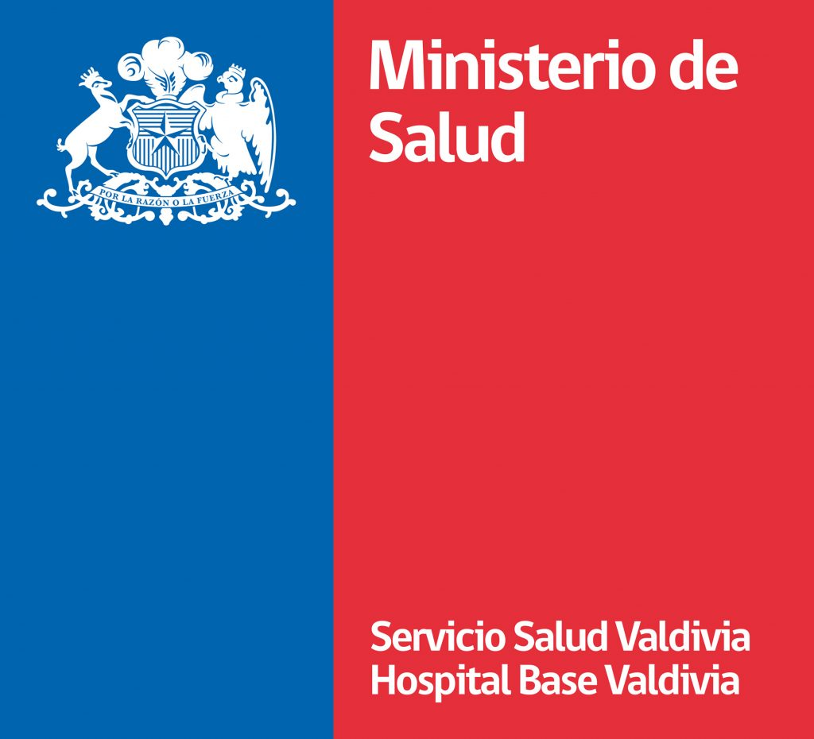

# Demanda en Urgencia para el Hospital Base de Valdivia

El siguiente dashboard presenta el análisis de la demanda en la unidad de urgencia para el hospital base de la ciudad de Valdivia, ubicado en la Región de los Ríos en Chile.

Para esto trabajamos con la información proporcionada por el Departamento de Estadísticas e Información de Salud perteneciente al Ministerio de Salud.

En el siguiente enlace se puede acceder a la ultima versión del dashboard -\> <https://anastasiarebolledo.shinyapps.io/Demanda_de_Urgencias/>
